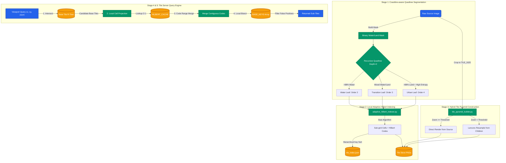
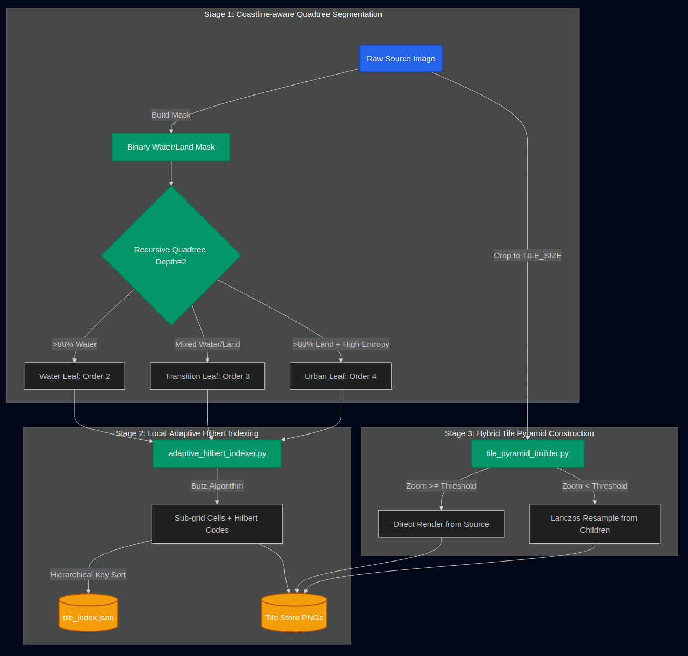
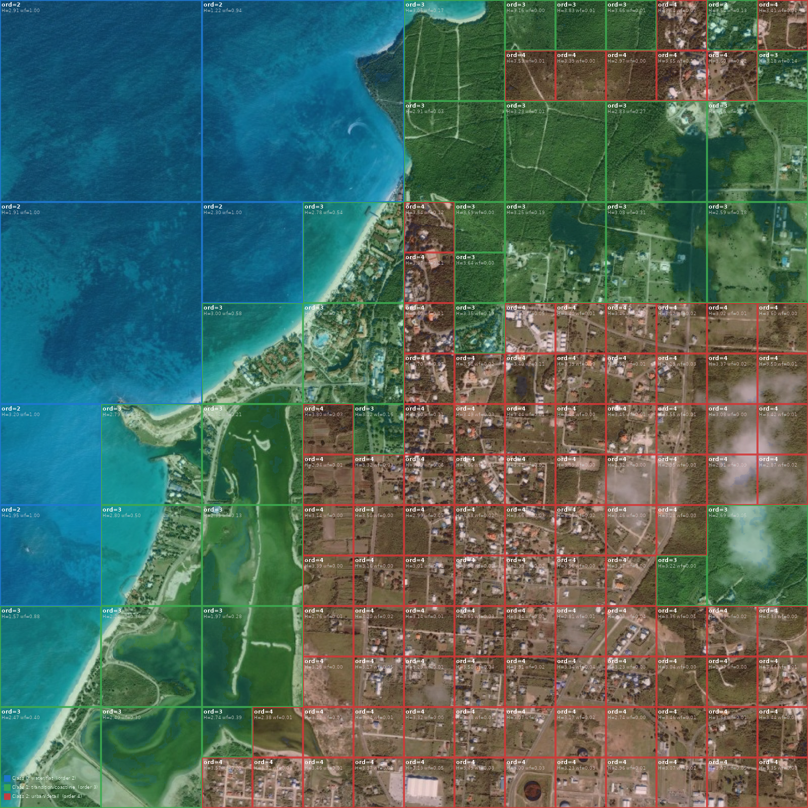
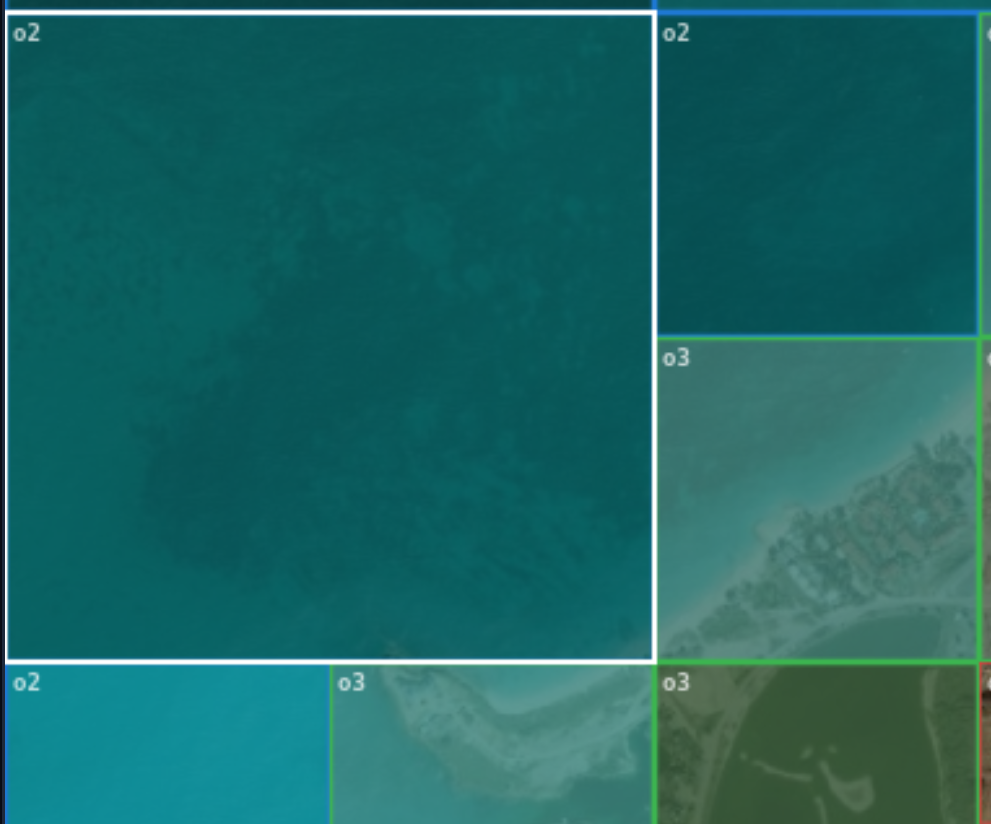
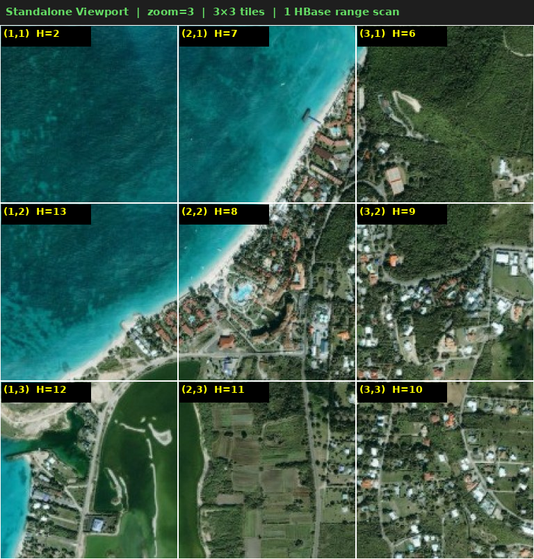
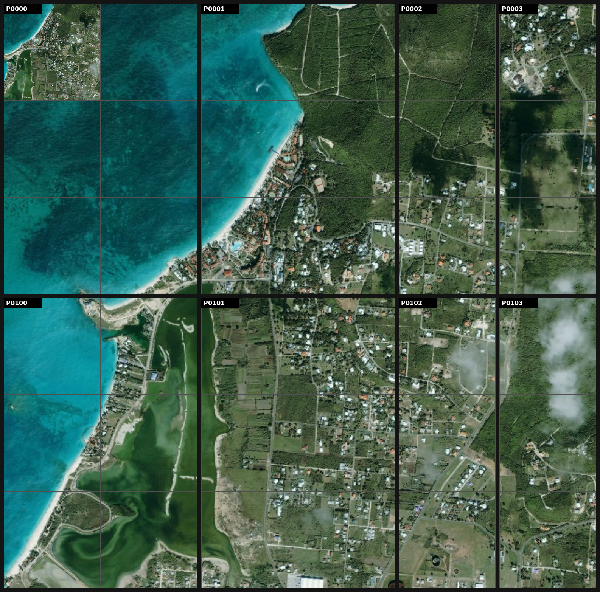

# Semantic-Adaptive Hilbert (SAH) Indexing System
**Code-Aligned Comprehensive Design Document**

---

## 1. Executive Summary
The Semantic-Adaptive Hilbert (SAH) Indexing System is a specialized spatial data processing pipeline. Unlike standard quadtrees that blindly subdivide space, SAH utilizes **Coastline-aware Adaptive Quadtree Segmentation** to construct an initial asymmetric grid, followed by **Local Adaptive Hilbert Indexing** to serialize the spatial data. This decoupled approach minimizes empty data processing, reduces memory footprints, and guarantees `O(log B + log N + K)` query speeds via R-Tree and Local Hilbert Bisection caching mechanisms. 

---

## 2. System Architecture & Flow (UML Diagram)

The system is organized into a linear pre-processing pipeline followed by an optimized in-memory query engine.

---

## 3. Pipeline Stages & Code Execution Flow

### Stage 1: Coastline-aware Quadtree Segmentation (`region_segmenter.py`)
Instead of a rigid grid, the image is decomposed via a recursive quadtree bounded to a maximum depth of 2.

**Step A: Binary Mask Generation**
A pixel-level mask is generated to cleanly isolate aquatic regions. A pixel is classified as water if the raw channel ratio `(B - R) / (R+G+B) >= 0.04`.

**Step B & C: Quadtree Subdivision**
Each base tile evaluates its geographic composition against the boolean mask:
1. **Predominantly Water** (`water_fraction >= 0.88`): Becomes a **Water Leaf (Class 0, Hilbert Order 2)** at any depth.
2. **Mixed Tile** (`water_fraction` between `0.12` and `0.88`): Automatically classified as a coastline boundary. Becomes a **Transition Leaf (Class 1, Order 3)**.
3. **Predominantly Land** (`water_fraction < 0.12`): 
   - **Depth 0:** Automatically split.
   - **Depth 1:** Entropy is evaluated. If `entropy >= 2.80` and the tile is large enough, it splits again. Otherwise, it defaults to a Transition Leaf.
   - **Depth 2:** Reaches maximum depth and becomes an **Urban Leaf (Class 2, Order 4)**.

> *The output of `region_segmenter.py`, detailing the asymmetric quadtree and specific regional classes.*

### Stage 2: Local Adaptive Hilbert Indexing (`adaptive_hilbert_indexer.py`)
Each resulting quadtree leaf is subdivided into an adaptive sub-grid based on its Hilbert Order (Order 2 → 4×4 grid, Order 3 → 8×8 grid, Order 4 → 16×16 grid). 

1. **Subdivision & Hilbert Coding:** For each sub-cell, a Hilbert code is mathematically calculated using the Butz algorithm.
2. **Key Generation:** A sortable hierarchical composite string key is generated for every sub-cell:
   `{region_class}_{order}_{base_tx}{base_ty}_{sub_x}{sub_y}_{hilbert}`
3. **Data Localization:** Sub-cells are saved as PNG tiles, and their metadata is written to `tile_index.json`. Crucially, because the composite key begins with `base_tx` and `base_ty`, **the indexing is localized to the quadtree base tile**, allowing for isolated, parallelizable binary searches during queries.

### Stage 3: Hybrid Tile Pyramid Construction (`tile_pyramid_builder.py`)
To prevent visual artifacts, the builder aggressively crops the image bounding box to be an exact multiple of the 256px `TILE_SIZE`, eliminating dead black spaces.

The pyramid is built dynamically matching Figure 5 workflows from Guo et al.:
* **Fine Details (Zoom >= Threshold):** Directly rendered (cropped) from the source array.
* **Overviews (Zoom < Threshold):** Uses a resampling algorithm, loading four 256×256 child tiles (2x2 grid) into a 512×512 composite, and applying a high-quality `LANCZOS` downsample back to 256×256.

### Stage 4: In-Memory Server Data Structures (`tile_server.py`)
At server startup, `tile_server.py` ingests the JSON mapping and populates highly optimized RAM structures to prevent disk I/O bottlenecks:
1. **`INDEX`**: Flat array containing all tile metadata.
2. **`BASE_LOOKUP`**: Dictionary mapping `(base_tx, base_ty)` to its respective sub-tiles.
3. **`BASE_KEYS`**: Extracted array of just the sorted Hilbert integer codes corresponding to `BASE_LOOKUP` to permit lightning-fast `bisect` searches.
4. **`base_rtree`**: A spatial R-Tree bounding-box index built strictly around the macroscopic quadtree base-tiles (not sub-tiles!).
5. **`HILBERT_CACHE`**: A precomputed lookup table storing all `xy_to_hilbert` spatial translations for Orders 2 through 7. This completely bypasses the mathematical Butz algorithm during real-time zoom queries.

### Stage 5: The 4-Step Query Engine (`tile_server.py`)
When a viewport query `(cx, cy, zoom)` is triggered, the `_hilbert_range_scan` executes:

1. **R-Tree Intersection `O(log B + K_b)`:** The viewport bounding box intersects the `base_rtree` to instantly prune distant quadtree leaves, returning only the candidate base tiles.
2. **Local Cell Projection & Cache Lookup:** For each candidate base tile, the viewport coordinates are mathematically mapped into the base tile's local sub-grid layout `(sx, sy)`. The code retrieves the precomputed Hilbert code from `HILBERT_CACHE`.
3. **Code Range Merging:** Overlapping, scattered cells are mathematically grouped into contiguous `(start_code, end_code)` bounding limits.
4. **Local Array Bisect `O(log N + K)`:** Binary search (`bisect_left` and `bisect_right`) jumps into the isolated `BASE_KEYS` array of that specific base tile, slicing out the data. A final geometric confirmation drops edge false-positives.

---

## 4. Dynamic Visual Render Order (Zoom-based Recalculation)

A crucial architectural distinction in the SAH system is the decoupling of the **Base Index Order** (used by the query engine) and the **Display Render Order** (used purely for visual context on the frontend).

1. **Base Index Order (Fixed)**: Determined by the quadtree depth and semantic complexity at ingestion time. This controls exactly how many sub-cell records exist in the `BASE_KEYS` arrays (e.g. 16 cells for Order 2). It *never* changes.
2. **Display Render Order (Dynamic)**: When the frontend zooms deeply into a collapsed tile, drawing a coarse 4x4 grid becomes visually unhelpful. Therefore, the visual Hilbert curve drawn on the React canvas is freshly recomputed in real-time based on zoom depth. As seen in `HilbertViewer.jsx`, the visual grid density scales dynamically when deeply zoomed.
   
This means a water tile at zoom depth 3 will visually draw a highly dense curve on screen, providing rich spatial context to the user, while the underlying query engine remains blazing fast because it only bisects against the original 16 sub-cells. **The denser curve you see growing as you zoom is purely cosmetic and dynamically synthesized on the client.**

> *The visual Hilbert curve path is dynamically recomputed on the frontend canvas per zoom level, entirely independent of the rigid backend indexing.*

---

## 5. Algorithmic Complexity

By utilizing `rtree_mod` for macro-filtering and local array `bisect` for micro-filtering, SAH vastly outperforms legacy spatial databases:

| Feature | Legacy Naive Scan | SAH Query Pipeline |
| :--- | :--- | :--- |
| **Grid Generation** | Uniform, symmetrical | Asymmetric, coastline-aware quadtree |
| **Search Space** | Entire database (`INDEX`) | Localized strictly to `BASE_KEYS` |
| **Code Translation** | Calculated on the fly | Constant time via `HILBERT_CACHE` |
| **Spatial Check Time**| O(N) | O(log B + log N + K) |
| **Off-screen Rejection**| Slow, linear check | Aggressive ~99% permanent pruning |

*(B = Base quadtree tiles, N = Sub-tiles per base tile, K = Sub-tiles in viewport)*. 

---

## 6. Dual Render Output Environments
The exact same `tile_server.py` backend feeds multiple display contexts:

**Condition A — Standalone React Display**
A React canvas interacts directly with the API. At low zoom levels, regions designated as "collapsed" draw precomputed mean-color solid rectangles to aggressively conserve RAM. At high zoom, they unpack and fetch live PNGs from the tile store.

**Condition B — Distributed SAGE2 Wall**
For multi-monitor interactive walls, `sage2_display_coordinator` clusters the Hilbert boundary space across physical UI panels. The identical query sequence is parallelized, fetching non-overlapping viewport intersections over WebSocket, stitching gigapixel frames inside 30fps rendering budgets.

